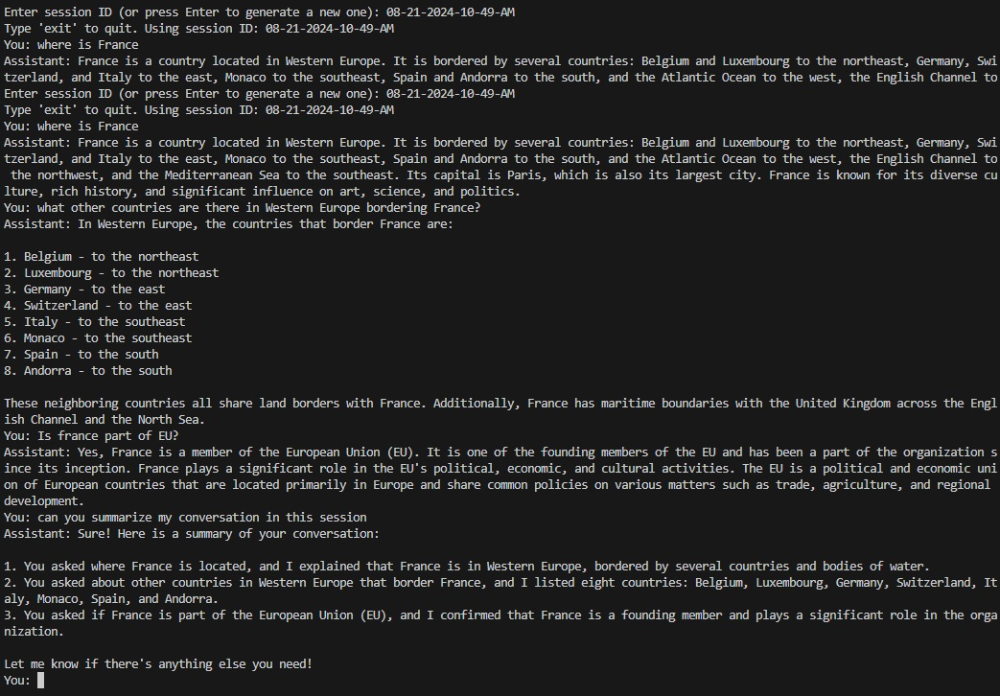
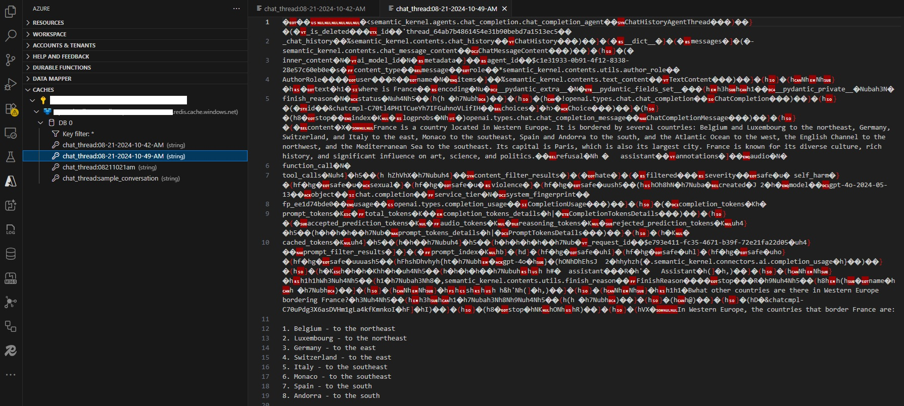

# Semantic Kernel ChatCompletionAgent with Azure Redis Cache

This sample demonstrates how to build a conversational AI agent using Microsoft's Semantic Kernel framework, with chat history stored in Azure Redis Cache for persistent, session-based conversations.

**Main file:** `sample_redis_chat_agent.py`

## Features
- Uses Semantic Kernel's `ChatCompletionAgent` for chat-based AI.
- Stores and retrieves chat history in Azure Redis Cache, allowing conversations to be resumed by session ID.
- Supports Azure OpenAI as the backend for chat completion.
- Loads configuration from a `.env` file for easy setup.

## Prerequisites
- Python 3.8+
- Azure Redis Cache instance
- Azure OpenAI resource

## Setup
1. **Install dependencies:**
   ```sh
   pip install semantic-kernel redis python-dotenv
   ```
2. **Create a `.env` file** in the same directory as the script with these variables:
   ```env
   REDIS_HOST=your-redis-host
   REDIS_PORT=6380
   REDIS_PASSWORD=your-redis-password
   AZURE_OPENAI_ENDPOINT=https://your-resource-name.openai.azure.com/
   AZURE_OPENAI_KEY=your-azure-openai-key
   AZURE_OPENAI_DEPLOYMENT=your-deployment-name
   ```
   (Adjust values as needed for your environment.)

## How It Works
- When you run the script, it loads environment variables from `.env`.
- You are prompted for a session ID. Enter an existing session ID to continue a previous conversation, or press Enter to generate a new one.
- The script connects to Azure Redis Cache and attempts to load the chat history for the given session ID.
- If no history exists, a new conversation thread is started.
- Each user message is sent to the Semantic Kernel agent, which uses Azure OpenAI to generate a response.
- The full conversation history (thread) is updated and saved back to Redis after each turn.
- You can exit the chat at any time by typing `exit`.

## Script Structure
- **Environment Loading:** Uses `python-dotenv` to load settings from `.env`.
- **Redis Helpers:** Functions to save and load the chat thread using `pickle` serialization.
- **Main Chat Loop:**
  - Prompts for session ID.
  - Loads or creates a chat history thread.
  - Runs a chat loop, sending user input to the agent and printing responses.
  - Updates and persists the thread in Redis after each turn.


## Example Usage
```sh
python sample_redis_chat_agent.py
```
- Enter a session ID to resume a previous chat, or press Enter to start a new one.
- Chat with the assistant. All turns are saved and can be resumed later with the same session ID.

## Example Output

### Session History in App


### Redis Session History


## Notes
- The chat history is stored in Redis under the key `chat_thread:<session_id>`.
- The script uses `pickle` for serialization.
- You can customize the agent's instructions or extend the script for more advanced scenarios.

---

**This sample is for demonstration purposes and can be adapted for production use with additional security and error handling as needed.**